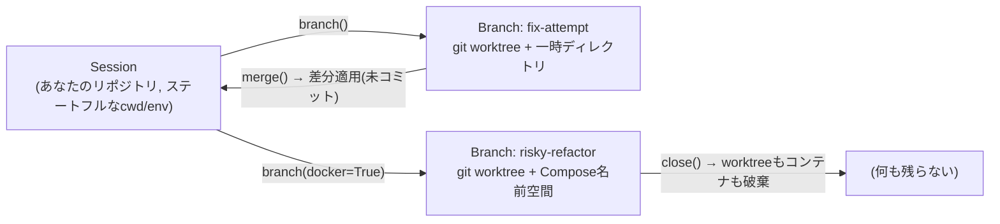

# Ramify

**AIエージェントに、安全に実験して失敗できる場所を。**

Ramifyは、**即時・使い捨てブランチ**を備えたAIエージェント向けのステートフルなターミナル実行ライブラリです。エージェントはワークスペースの隔離コピーを一瞬で作り、リスクのある操作を試し、結果が良ければマージ、ダメならファイルもコンテナもまるごと破棄できます。

[English README](README.md) | [ドキュメント](https://torippy01.github.io/ramify/)

```python
from ramify import Session

s = Session(cwd="/path/to/your/repo")

b = s.branch("risky-refactor")     # git worktreeによる隔離ブランチ(約0.1秒)
b.run("rm -rf tests/legacy && pytest -q")
s.merge(b)                          # 採用 → 差分が未コミット変更として本体に反映
b.close()                           # 破棄 → worktree・ファイル・コンテナを完全削除
```

## なぜRamifyか

シェルコマンドを実行するエージェントは、今日どちらかの妥協を強いられます:

- **生のローカルシェル** — 速いが、間違ったディレクトリでの `rm -rf` 一発が取り返しのつかない損害になる。すべてのコマンドがロールバック不能な共有状態を変更する。
- **タスクごとのコンテナサンドボックス** — 安全だが重い。試行のたびに数秒の起動、イメージの保守、そして実際のワークスペースとは違うファイルシステム。

Ramifyは第三の道、**すでに持っている隔離機構を借りる**アプローチを取ります。Gitにはワークスペースのコピーオンライト複製(`git worktree`)が、Docker Composeには名前空間分離(`COMPOSE_PROJECT_NAME`)があります。Ramifyはこれらを4つの原則に基づくセッション/ブランチモデルに構成します:

1. **ブランチは思考と同じくらい軽く。** サンドボックスが高価だという理由でエージェントが試行をためらってはいけない。worktreeブランチはほぼ即時に作られ、オブジェクトストアを親リポジトリと共有します。
2. **クリーンアップは決定的に。** `close()` は「なるべく」掃除するのではなく、worktree・一時ディレクトリ・Composeスタックの破棄を保証します。残留状態も、雪だるま式の副作用もなし。
3. **ロールバックできないものはブロック。** ファイル変更は戻せますが、`sudo` / `systemctl` / `apt` / `brew` は戻せません。Ramifyはホストを変更するコマンドを実行**前**に検知し、`GlobalStateError` を送出します。
4. **出力はログではなくトークン予算。** 結果はLLM消費向けに圧縮されます: ANSIノイズや進捗表示を除去、長い出力は先頭+末尾を保持、失敗は `error_tail` に要約。生のstdout/stderrはPython側に保持されます。

## 機能

- **ステートフルなセッション** — `cd` や `export` が `run()` をまたいで持続。本物のターミナルと同じ感覚で、エージェントが毎回コンテキストを再構築する必要がありません。
- **即時ブランチ** — `session.branch(name)` が隔離worktreeを作成。`merge()` はブランチの差分を親のワーキングツリーに**未コミットで**適用(コミット権は人間に残る)。`close()` はすべてを破棄。
- **Docker隔離** — `branch(name, docker=True)` でComposeプロジェクトをブランチごとに名前空間分離。実験中のコンテナが衝突したり、ブランチより長生きしたりしません。
- **セーフティガード** — ホストを変更するコマンド(`sudo`、`systemctl`、`apt`、`apt-get`、`brew` など)を実行前にブロックし、エージェントが対処できる理由を返します。
- **トークン最適化された結果** — `CommandResult.to_llm_json()` はコンパクトなJSONを出力: `cmd` / `exit` / `cwd` は常に、`stdout`、`stderr`、`error_tail`、`env_changes`、`modified_files` は値がある場合のみ。
- **オプションのコマンドビルダー** — 主役はあくまで素のBash文字列ですが、プログラム的に組み立てたいときは薄い演算子DSLも使えます: `(s.cat("app.log") | s.grep("ERROR")).exec()`、`(s.echo("hi") > "out.txt").exec()`。
- **MCPサーバー** — `ramify_run`、`ramify_branch`、`ramify_merge`、`ramify_close` の4ツールで、Claude Code・Claude Desktop・任意のMCPクライアントからセッションとブランチを利用できます。

## ユースケース

- **触る前にテストするコーディングエージェント。** マイグレーション、依存関係の更新、大胆なリファクタリングをブランチで実行。テストが通ればマージ、通らなければ `close()`。ユーザーのツリーは壊れた中間状態を一度も見ません。
- **並列探索。** 同じ問題にN個のアプローチをN個のブランチで試し、結果を比較して勝者をマージ。worktreeは十分軽いので、これを贅沢ではなくデフォルト戦略にできます。
- **自律ループのガードレール。** 長時間動くエージェントは状態のドリフト(中途半端な編集、迷子のコンテナ、変異したenv)を蓄積します。セッションは意図した状態(`cwd`、`env`)を保持し、ブランチがそれ以外を隔離します。
- **MCPネイティブなサンドボックス。** `ramify-mcp` をClaude Codeに繋げば、branch/merge/rollbackがトークン効率の良い出力込みでファーストクラスのツールになります。

## 仕組み



ブランチの実体は一時ディレクトリ内の本物のgit worktreeです: 同じ履歴、同じツール、隔離されたファイル。`merge()` はブランチの差分を計算して親のワーキングツリーに適用します — 変更は**未コミット**で届くため、人間のレビューなしに履歴へ入ることはありません。マージの失敗(編集の衝突など)はアトミックです: 親ツリーは無傷のまま、ブランチは生き続け、リトライできます。

## インストール

**Python 3.10+** と **git** が必要です(**docker** はDocker隔離を使う場合のみ)。

```bash
pip install git+https://github.com/torippy01/ramify.git

# MCPサーバーを使う場合
pip install "ramify[mcp] @ git+https://github.com/torippy01/ramify.git"

# ローカル開発(editable)
git clone https://github.com/torippy01/ramify.git && cd ramify
uv sync   # または: pip install -e ".[dev,mcp]"
```

## クイックスタート

```python
from ramify import Session, GlobalStateError

s = Session(cwd="/path/to/your/git/repo")

# 1. ステートフル: cd / export が次のrun()に引き継がれる
s.run("cd src")
s.run("export API_KEY=xxx")

# 2. LLM向けのコンパクトJSON。生の出力はresultオブジェクトに保持
result = s.run("pytest -q")
print(result.to_llm_json())  # {"cmd":"pytest -q","exit":0,"cwd":...,"stdout":...}
print(result.stdout)         # サニタイズ前の完全な出力

# 3. 文字列組み立てより綺麗なときはプログラム的に構築
(s.cat("app.log") | s.grep("ERROR")).exec()
(s.echo("hello") > "out.txt").exec()

# 4. ロールバック不能なコマンドは実行前にブロック
try:
    s.run("sudo apt-get install nginx")
except GlobalStateError as e:
    print(e)  # "privilege escalation affects the whole host"

# 5. ブランチ → 実験 → マージ or 破棄
b = s.branch("experiment")
b.run("echo 'try something' > note.txt")   # 親ツリーには影響なし
s.merge(b)                                  # 差分を親に適用(未コミット)
b.close()                                   # 決定的クリーンアップ

s.close()
```

コンテキストマネージャとしても使えます:

```python
with Session(cwd="/path/to/repo") as s:
    print(s.run("pytest -q").to_llm_json())
```

### `CommandResult.to_llm_json()` の形式

常に出力: `cmd`、`exit`、`cwd`。値がある場合のみ出力:

| キー | 内容 |
| --- | --- |
| `stdout` | サニタイズ済みstdout — ANSI・進捗ノイズを除去し、長い場合は先頭+末尾を保持 |
| `stderr` | サニタイズ・圧縮されたstderr |
| `error_tail` | 失敗時の診断用エラー末尾(stderrを優先) |
| `env_changes` | コマンド前後で変化した環境変数 |
| `modified_files` | Gitリポジトリルートからの相対パスによる変更ファイル一覧 |

## MCPサーバー

```bash
pip install "ramify[mcp]"
```

Claude Code / Claude Desktopの設定:

```json
{
  "mcpServers": {
    "ramify": {
      "command": "ramify-mcp"
    }
  }
}
```

サーバーはstdioで動作し、`ramify_run`、`ramify_branch`、`ramify_merge`、`ramify_close` を提供します。`ramify_run` を `session_id` なしで呼ぶとセッションが暗黙に作成され、`branch_id` を渡すとブランチ内で実行されます。詳細は[MCPガイド](https://torippy01.github.io/ramify/guide/mcp/)を参照してください。

## 開発

```bash
uv sync
uv run pytest                                  # テスト
uv run ruff check src/ tests/ && uv run ruff format src/ tests/
uv run mypy src/                               # strict型チェック
```

```
src/ramify/
├── core/       # Session, SessionBranch, Command
├── drivers/    # git worktree / Docker 隔離バックエンド
├── guards/     # SafetyGuard(ホスト変更コマンドの検査)
├── models/     # CommandResult
├── state/      # ワークスペース状態の追跡
└── utils/      # 出力サニタイズ・トークン削減
```

## ステータスとロードマップ

Ramifyは若いプロジェクト(v0.1.0)で、活発に開発中です。ビジョンは、AIエージェントフレームワークの標準的な実行・状態管理エンジンになること — タスクごとのコンテナのオーバーヘッドや無防備なローカルシェルの代わりに、軽量なセッションブランチと決定的ロールバックを提供します。今後の方向性は [ROADMAP.md](ROADMAP.md) を、issueやフィードバックは大歓迎です。

## ライセンス

[MIT](pyproject.toml)
