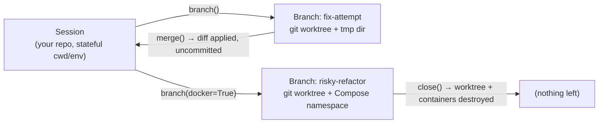

# Ramify

**Give AI agents a safe space to experiment — and fail.**

Ramify is a stateful terminal execution library with **instant, disposable branching** for AI agents. It lets an agent spin up an isolated copy of your workspace in a fraction of a second, try something risky, and then either merge the result back or throw the whole thing away — files, containers, and all.

[日本語版 README](README.ja.md) | [Documentation](https://torippy01.github.io/ramify/)

```python
from ramify import Session

s = Session(cwd="/path/to/your/repo")

b = s.branch("risky-refactor")     # isolated git worktree, created in ~0.1s
b.run("rm -rf tests/legacy && pytest -q")
s.merge(b)                          # keep it — changes land in your tree, uncommitted
b.close()                           # or drop it — worktree, files, containers: all gone
```

## Why Ramify

Agents that execute shell commands today face a bad trade-off:

- **Raw local shell** — fast, but one `rm -rf` in the wrong directory and the damage is permanent. Every command mutates shared state that nobody can roll back.
- **Container-per-task sandboxes** — safe, but heavyweight. Seconds of startup per attempt, image maintenance, and a filesystem that doesn't look like the user's actual workspace.

Ramify takes a third path: **borrow the isolation you already have**. Git gives you copy-on-write workspace clones (`git worktree`); Docker Compose gives you namespaced container stacks (`COMPOSE_PROJECT_NAME`). Ramify composes these into a session/branch model designed around four principles:

1. **Branching should be as cheap as a thought.** An agent should never hesitate to try something because the sandbox is expensive. Worktree branches are near-instant and share object storage with the parent repo.
2. **Cleanup must be deterministic.** `close()` doesn't "try" to clean up — it guarantees worktrees, temp dirs, and Compose stacks are destroyed. No leftover state, no snowballing side effects.
3. **What can't be rolled back must be blocked.** File changes revert; `sudo`, `systemctl`, `apt`, and `brew` don't. Ramify intercepts host-mutating commands *before* they run and raises `GlobalStateError`.
4. **Output is a token budget, not a log file.** Results are compacted for LLM consumption: ANSI noise and progress spinners stripped, long output trimmed head+tail, failures summarized in an `error_tail`. Raw stdout/stderr stay available in Python.

## Features

- **Stateful sessions** — `cd` and `export` persist across `run()` calls, like a real terminal. Agents don't need to re-derive context every command.
- **Instant branches** — `session.branch(name)` creates an isolated git worktree; `merge()` applies the branch's diff back to the parent working tree (uncommitted, so a human still owns the commit); `close()` destroys everything.
- **Docker isolation** — `branch(name, docker=True)` namespaces Compose projects per branch, so containers started in an experiment can't collide with — or outlive — the branch.
- **Safety guard** — host-mutating commands (`sudo`, `systemctl`, `apt`, `apt-get`, `brew`, …) are blocked pre-execution with an explanation the agent can act on.
- **Token-optimized results** — `CommandResult.to_llm_json()` emits compact JSON: always `cmd` / `exit` / `cwd`, plus `stdout`, `stderr`, `error_tail`, `env_changes`, and `modified_files` only when present.
- **Optional command builder** — plain Bash strings are the primary interface, but a thin operator DSL is there when composing programmatically: `(s.cat("app.log") | s.grep("ERROR")).exec()`, `(s.echo("hi") > "out.txt").exec()`.
- **MCP server** — expose sessions and branches to Claude Code, Claude Desktop, or any MCP client via four tools: `ramify_run`, `ramify_branch`, `ramify_merge`, `ramify_close`.

## Use cases

- **Coding agents that test before they touch.** Run the migration, the dependency bump, or the aggressive refactor in a branch. Merge only if the test suite passes; `close()` if it doesn't. The user's tree never sees a broken intermediate state.
- **Parallel exploration.** Fan out N branches trying N approaches to the same problem, compare results, merge the winner. Worktrees are cheap enough to make this a default strategy rather than a luxury.
- **Guardrails for autonomous loops.** Long-running agents accumulate state drift — half-applied edits, stray containers, mutated env. Sessions keep intended state (`cwd`, `env`) and branches quarantine everything else.
- **MCP-native sandboxing.** Plug `ramify-mcp` into Claude Code and the agent gets branch/merge/rollback as first-class tools, with token-efficient output baked in.

## How it works



A branch is a real git worktree in a temp directory: same history, same tooling, isolated files. `merge()` computes the branch's diff and applies it to the parent working tree — changes arrive **uncommitted**, so nothing lands in history without human review. A failed merge (e.g., conflicting edits) is atomic: the parent tree is untouched and the branch stays alive for a retry.

## Installation

Requires **Python 3.10+** and **git** (plus **docker** only for Docker isolation).

```bash
pip install git+https://github.com/torippy01/ramify.git

# with MCP server support
pip install "ramify[mcp] @ git+https://github.com/torippy01/ramify.git"

# local development (editable)
git clone https://github.com/torippy01/ramify.git && cd ramify
uv sync   # or: pip install -e ".[dev,mcp]"
```

## Quick start

```python
from ramify import Session, GlobalStateError

s = Session(cwd="/path/to/your/git/repo")

# 1. Stateful: cd / export carry over to the next run()
s.run("cd src")
s.run("export API_KEY=xxx")

# 2. Compact JSON for the LLM; raw output stays on the result object
result = s.run("pytest -q")
print(result.to_llm_json())  # {"cmd":"pytest -q","exit":0,"cwd":...,"stdout":...}
print(result.stdout)         # full, unsanitized output

# 3. Compose commands programmatically when it's cleaner than string building
(s.cat("app.log") | s.grep("ERROR")).exec()
(s.echo("hello") > "out.txt").exec()

# 4. Un-rollbackable commands are blocked up front
try:
    s.run("sudo apt-get install nginx")
except GlobalStateError as e:
    print(e)  # "privilege escalation affects the whole host"

# 5. Branch → experiment → merge or destroy
b = s.branch("experiment")
b.run("echo 'try something' > note.txt")   # parent tree unaffected
s.merge(b)                                  # apply diff to parent (uncommitted)
b.close()                                   # deterministic cleanup

s.close()
```

Sessions are also context managers:

```python
with Session(cwd="/path/to/repo") as s:
    print(s.run("pytest -q").to_llm_json())
```

### `CommandResult.to_llm_json()`

Always present: `cmd`, `exit`, `cwd`. Present only when meaningful:

| Key | Content |
| --- | --- |
| `stdout` | Sanitized stdout — ANSI/progress noise removed, long output trimmed to head + tail |
| `stderr` | Sanitized, compacted stderr |
| `error_tail` | On failure, the diagnostic tail (prefers stderr) |
| `env_changes` | Environment variables that changed during the command |
| `modified_files` | Files changed, relative to the git repo root |

## MCP server

```bash
pip install "ramify[mcp]"
```

Claude Code / Claude Desktop config:

```json
{
  "mcpServers": {
    "ramify": {
      "command": "ramify-mcp"
    }
  }
}
```

The server speaks stdio and exposes `ramify_run`, `ramify_branch`, `ramify_merge`, and `ramify_close`. Calling `ramify_run` without a `session_id` creates a session implicitly; pass a `branch_id` to run inside a branch. See the [MCP guide](https://torippy01.github.io/ramify/guide/mcp/) for details.

## Development

```bash
uv sync
uv run pytest                                  # tests
uv run ruff check src/ tests/ && uv run ruff format src/ tests/
uv run mypy src/                               # strict type checking
```

```
src/ramify/
├── core/       # Session, SessionBranch, Command
├── drivers/    # git worktree / Docker isolation backends
├── guards/     # SafetyGuard (host-mutating command interception)
├── models/     # CommandResult
├── state/      # workspace state tracking
└── utils/      # output sanitization & token reduction
```

## Status & roadmap

Ramify is young (v0.1.0) and moving fast. The vision: become the standard execution and state-management engine for AI agent frameworks — lightweight session branching and deterministic rollback instead of container-per-task overhead or unprotected local shells. See [ROADMAP.md](ROADMAP.md) for where it's headed; issues and feedback are very welcome.

## License

[MIT](pyproject.toml)
